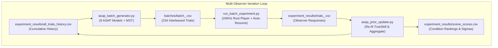

# GAIM240 ASAP Batch Experiment Protocol & User Guide

This document outlines the architecture, theory, data flow, and step-by-step experimental protocol for the GAIM240 Active Sampling Perception Experiment using **ASAP in Multi-Scene Batch Mode** coupled with the hardware-accelerated **240Hz Rust Pyramid Player**.

---

## 1. Overview & Theoretical Principles

### 1.1 Disjoint Intra-Scene Comparisons
The dataset consists of **9 scenes** (`attic`, `bistro_exterior`, `bistro_interior`, `classroom`, `landscape`, `marbles`, `pink_room`, `subway`, `zeroday`), each containing **27 distortion conditions** (9 distortion metrics $\times$ 3 intensity levels) plus 1 uncompressed reference video ($9 \times 27 = 243$ conditions).

Comparisons are strictly **intra-scene**: an observer compares two distortions of Scene $S$ against the Reference of Scene $S$. Because there are no cross-scene comparisons (e.g., comparing an `attic` distortion against a `marbles` distortion), the comparison graph across all conditions is disjoint into 9 disconnected components.

Therefore, the system maintains **9 independent ASAP active sampling models** (one per scene). Each model tracks its own $27 \times 27$ comparison matrix $M_{\text{scene}}$ and TrueSkill posterior $(\boldsymbol{\mu}_{\text{scene}}, \boldsymbol{\sigma}_{\text{scene}})$.

### 1.2 Batch Generation via Minimum Spanning Tree (MST)
Rather than sequential single-trial online sampling, the experiment operates in **batch mode**:
1. For each scene $S$, ASAP evaluates the Expected Information Gain (EIG) across all candidate pairs.
2. An optimal **Minimum Spanning Tree (MST)** of size $(N_{\text{scene}} - 1) = 26$ pairs is extracted per scene.
3. MST pair selection guarantees graph connectivity, prevents isolated conditions, and maximizes total information gain across the scale.
4. Across all 9 scenes, a single observer session consists of **$26 \times 9 = 234$ presentation trials**.

### 1.3 Perceptual Interleaving & Spatial Counterbalancing
To prevent observer fatigue and keep perceptual judgements sharp:
- **Stratified Pseudo-Random Mixing**: Trials from all 9 scenes are shuffled into an interleaved presentation queue such that no single scene appears more than 2 times consecutively.
- **Spatial Counterbalancing**: Condition assignment to the Left vs. Right display window is randomized with a 50/50 distribution.

### 1.4 Sequential Prior Updates Across Observers
After Observer $k$ finishes their 234 trials:
1. The observer's choices are logged to `experiment_results/trials_<subject>.csv`.
2. All observer logs are aggregated into `experiment_results/all_trials_history.csv`.
3. The 9 scene comparison matrices $M_{\text{scene}}$ are incremented with the new outcomes ($M_{\text{scene}}[i, j] += 1$).
4. TrueSkill re-estimates the visual quality scale ($\boldsymbol{\mu}$) and uncertainty ($\boldsymbol{\sigma}$) for all 243 conditions.
5. When generating the batch for Observer $k+1$, ASAP conditions on the updated posteriors to select the next most informative MST pairs.



---

## 2. File & Directory Structure

```text
videoplayer/
├── asap_batch_generator.py      # Generates batches/batch_<subject>.csv (9 ASAP MSTs)
├── run_batch_experiment.py      # Executes 240Hz presentations with auto-resume
├── asap_prior_updater.py        # Aggregates logs, updates matrices & solves TrueSkill
├── run_asap_experiment.py       # Unified master CLI wrapper
├── batches/                     # Pre-generated batch CSV files per observer
│   ├── batch_P01.csv
│   └── batch_P02.csv
├── experiment_results/          # Trial logs and inferred quality scale scores
│   ├── trials_P01.csv           # Subject P01 individual trial log
│   ├── trials_P02.csv           # Subject P02 individual trial log
│   ├── all_trials_history.csv   # Deduplicated master trial history
│   └── scene_scores.csv         # Latest TrueSkill scores (Mean ± StdDev)
└── rust_player/                 # Native 240Hz pyramid presentation binary
```

---

## 3. Quick Start & Command Guide

### 3.1 Unified Single-Command Workflow (Recommended)
To run a complete session for observer `P01` (generates batch, runs 240Hz presentations, and updates priors automatically):
```bash
python run_asap_experiment.py --subject P01
```

For observer `P02` (conditions on P01's results automatically):
```bash
python run_asap_experiment.py --subject P02
```

### 3.2 Decoupled Modular Workflow
If you prefer managing each step separately:

#### Step 1: Generate the presentation batch
```bash
python asap_batch_generator.py --subject P01
```
*Creates `batches/batch_P01.csv` containing 234 interleaved trials with spatial counterbalancing.*

#### Step 2: Run the experiment session
```bash
python run_batch_experiment.py --subject P01
```
*Presents each trial on the 240Hz pyramid display. Keypresses (`A`/`D` or Left/Right Arrow) and millisecond reaction times are logged to `experiment_results/trials_P01.csv`.*

#### Step 3: Update priors and inspect quality scores
```bash
python asap_prior_updater.py
```
*Aggregates all trial files into `experiment_results/all_trials_history.csv` and outputs `experiment_results/scene_scores.csv`.*

---

## 4. Key Features & CLI Reference

### 4.1 Auto-Resume on Interruption
If a session is interrupted (e.g. participant needs a break or presses `ESC`), the session progress is saved immediately.
Re-running the experiment for that subject will **automatically resume from the next unanswered trial**:
```bash
python run_asap_experiment.py --subject P01
```

### 4.2 Presentation Options
- `--pacer` (Default: ON): Enables the 240.000 Hz software frame pacer for drift-free frame delivery.
- `--no-pacer`: Disables software frame pacing.
- `--no-vsync`: Uncaps presentation throughput for performance benchmarking.
- `--borderless`: Runs in borderless windowed mode.
- `--dataset <path>`: Explicit path to the GAIM240 dataset directory (defaults to auto-detected path).

### 4.3 Stage Selectors in `run_asap_experiment.py`
- `--generate-only`: Only generate the batch CSV.
- `--run-only`: Only run the presentation without regenerating an existing batch.
- `--update-only`: Re-aggregate history and output scores without running presentations.

---

## 5. Output Data Formats

### `batches/batch_<subject>.csv`
| Column | Description | Example |
| :--- | :--- | :--- |
| `TrialNumber` | Presentation sequence number (1–234) | `1` |
| `SubjectID` | Observer identifier | `P01` |
| `Scene` | Scene name | `classroom` |
| `RefFilename` | Uncompressed reference video filename | `classroom_reference.mp4` |
| `RefPath` | Absolute path to reference video | `/home/jv495/Datasets/GAIM240/classroom_reference.mp4` |
| `LeftCondition` | Condition name displayed on the left | `classroom:motion_resolution_level2` |
| `LeftPath` | Absolute path to left video file | `/home/jv495/Datasets/GAIM240/classroom_motion_resolution_level2.mp4` |
| `RightCondition`| Condition name displayed on the right | `classroom:temporal-resolution-multiplexing_level1`|
| `RightPath` | Absolute path to right video file | `/home/jv495/Datasets/GAIM240/classroom_temporal-resolution-multiplexing_level1.mp4` |

### `experiment_results/trials_<subject>.csv`
Logs observer responses, reaction time (seconds), presentation FPS, and selected vs. rejected condition for every completed trial.

### `experiment_results/scene_scores.csv`
| Column | Description |
| :--- | :--- |
| `Scene` | Scene identifier (`attic`, `zeroday`, etc.) |
| `RankInScene` | Quality rank within this scene (1 = highest visual quality) |
| `ConditionName` | Full condition identifier (`scene:metric_level`) |
| `Metric` | Distortion metric (`dlss_rr`, `judder`, `motion_noise`, etc.) |
| `Level` | Distortion intensity (`level0`, `level1`, `level2`) |
| `VisualQuality_Mean` | Inferred TrueSkill mean score ($\mu$ in JND units) |
| `Uncertainty_StdDev` | TrueSkill posterior uncertainty ($\sigma$) |
| `ComparisonsCount` | Number of times this condition has been compared across all observers |
